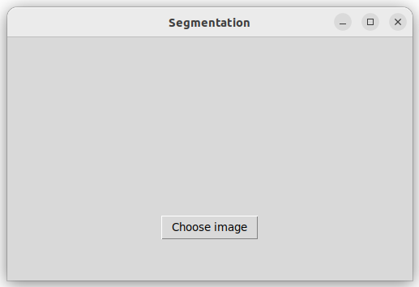
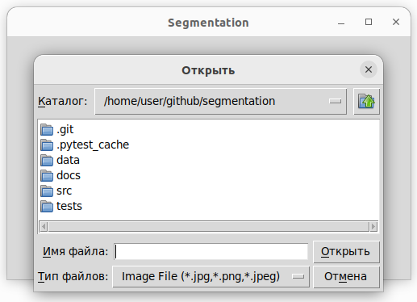
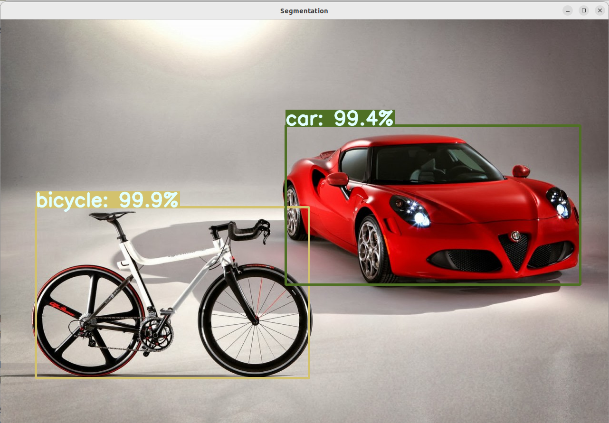

## Приложение для сегментации изображений

-----

### Постановка задачи
Реализовать приложение для сегментации изображений. Пользователь должен иметь возможность выбирать изображения через удобный интерфейс.

-----

### Реализация
Приложение написано на языке python, для реализации графического интерфейса используется библиотека Tkinter, сегментация изображений осуществляется при помощи предобученной модели maskrcnn_resnet50_fpn из torchvision.

-----

### Команды

#### Запуск
``` bash
python3 src/main.py
```
#### Тестирование
``` bash
doit tests
```
#### Проверка flake8
``` bash
doit flake8
```
#### Проверка pydocstyle
``` bash
doit pydocstyle
```
#### Документация
``` bash
doit html
```
#### Сборка wheel
``` bash
doit wheel
```

-----

### Взаимодействие
При запуске программы появляется окно:


После нажатия кнопки Choose image пользователь получает возможность выбрать изображение формата jpg, png, jpeg.


После отработки модели (занимает несколько секунд) сегментированное изображение выводится на экран (окошки, классы, а также степень уверенности модели в ответе)


-----

